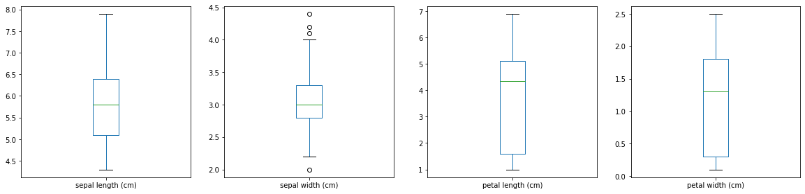
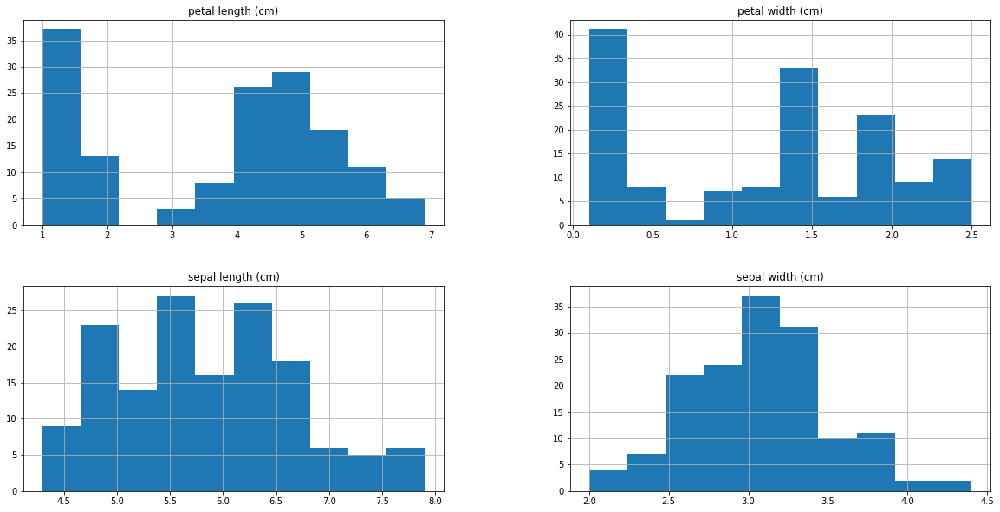
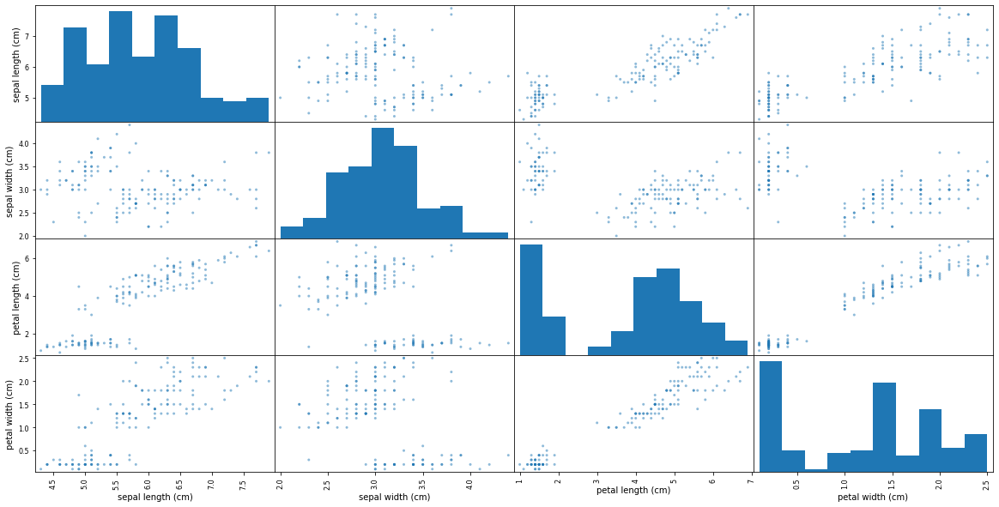
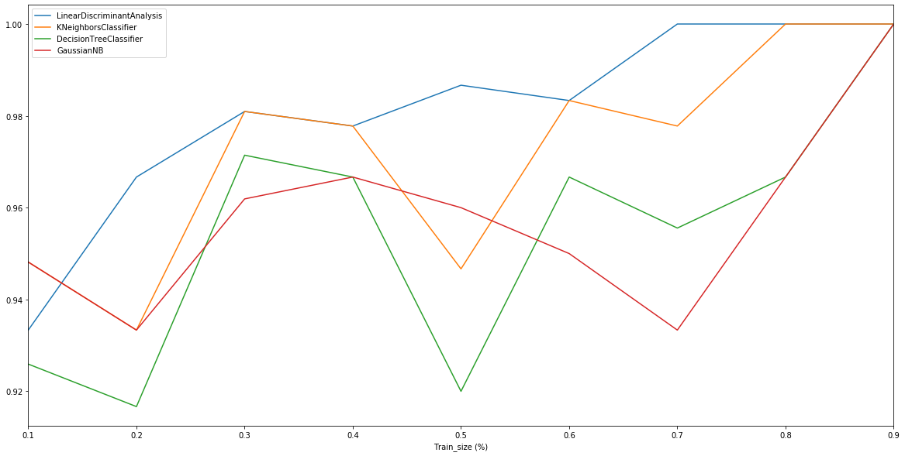

# Iris Training

Iris flower data set,


Input:
    


Output:
    


```python
from sklearn import datasets
from pandas import *
import matplotlib.pyplot as plt
from pandas.plotting import scatter_matrix
from numpy import array

from sklearn import model_selection
from sklearn.metrics import classification_report, confusion_matrix, accuracy_score
from sklearn.linear_model import LogisticRegression
from sklearn.tree import DecisionTreeClassifier
from sklearn.neighbors import KNeighborsClassifier
from sklearn.discriminant_analysis import LinearDiscriminantAnalysis
from sklearn.naive_bayes import GaussianNB
from sklearn.svm import SVC

from IPython.display import HTML, display
from tabulate import tabulate

def table(df): display(HTML(tabulate(df, tablefmt='html', headers='keys', showindex=False)))
```


```python
# IRIS
iris = datasets.load_iris()
print(iris.DESCR)
```

    .. _iris_dataset:
    
    Iris plants dataset
    --------------------
    
    **Data Set Characteristics:**
    
        :Number of Instances: 150 (50 in each of three classes)
        :Number of Attributes: 4 numeric, predictive attributes and the class
        :Attribute Information:
            - sepal length in cm
            - sepal width in cm
            - petal length in cm
            - petal width in cm
            - class:
                    - Iris-Setosa
                    - Iris-Versicolour
                    - Iris-Virginica
                    
        :Summary Statistics:
    
        ============== ==== ==== ======= ===== ====================
                        Min  Max   Mean    SD   Class Correlation
        ============== ==== ==== ======= ===== ====================
        sepal length:   4.3  7.9   5.84   0.83    0.7826
        sepal width:    2.0  4.4   3.05   0.43   -0.4194
        petal length:   1.0  6.9   3.76   1.76    0.9490  (high!)
        petal width:    0.1  2.5   1.20   0.76    0.9565  (high!)
        ============== ==== ==== ======= ===== ====================
    
        :Missing Attribute Values: None
        :Class Distribution: 33.3% for each of 3 classes.
        :Creator: R.A. Fisher
        :Donor: Michael Marshall (MARSHALL%PLU@io.arc.nasa.gov)
        :Date: July, 1988
    
    The famous Iris database, first used by Sir R.A. Fisher. The dataset is taken
    from Fisher's paper. Note that it's the same as in R, but not as in the UCI
    Machine Learning Repository, which has two wrong data points.
    
    This is perhaps the best known database to be found in the
    pattern recognition literature.  Fisher's paper is a classic in the field and
    is referenced frequently to this day.  (See Duda & Hart, for example.)  The
    data set contains 3 classes of 50 instances each, where each class refers to a
    type of iris plant.  One class is linearly separable from the other 2; the
    latter are NOT linearly separable from each other.
    
    .. topic:: References
    
       - Fisher, R.A. "The use of multiple measurements in taxonomic problems"
         Annual Eugenics, 7, Part II, 179-188 (1936); also in "Contributions to
         Mathematical Statistics" (John Wiley, NY, 1950).
       - Duda, R.O., & Hart, P.E. (1973) Pattern Classification and Scene Analysis.
         (Q327.D83) John Wiley & Sons.  ISBN 0-471-22361-1.  See page 218.
       - Dasarathy, B.V. (1980) "Nosing Around the Neighborhood: A New System
         Structure and Classification Rule for Recognition in Partially Exposed
         Environments".  IEEE Transactions on Pattern Analysis and Machine
         Intelligence, Vol. PAMI-2, No. 1, 67-71.
       - Gates, G.W. (1972) "The Reduced Nearest Neighbor Rule".  IEEE Transactions
         on Information Theory, May 1972, 431-433.
       - See also: 1988 MLC Proceedings, 54-64.  Cheeseman et al"s AUTOCLASS II
         conceptual clustering system finds 3 classes in the data.
       - Many, many more ...
    


```python
# IRIS TRAINING OUTPUT
data = [list(s)+[iris.target_names[iris.target[i]]] for i,s in enumerate(iris.data)]
dataset = DataFrame(data, columns=iris.feature_names+['class'])
table(dataset)
```


<table>
<thead>
<tr><th style="text-align: right;">  sepal length (cm)</th><th style="text-align: right;">  sepal width (cm)</th><th style="text-align: right;">  petal length (cm)</th><th style="text-align: right;">  petal width (cm)</th><th>class     </th></tr>
</thead>
<tbody>
<tr><td style="text-align: right;">                5.1</td><td style="text-align: right;">               3.5</td><td style="text-align: right;">                1.4</td><td style="text-align: right;">               0.2</td><td>setosa    </td></tr>
<tr><td style="text-align: right;">                4.9</td><td style="text-align: right;">               3  </td><td style="text-align: right;">                1.4</td><td style="text-align: right;">               0.2</td><td>setosa    </td></tr>
<tr><td style="text-align: right;">                4.7</td><td style="text-align: right;">               3.2</td><td style="text-align: right;">                1.3</td><td style="text-align: right;">               0.2</td><td>setosa    </td></tr>
<tr><td style="text-align: right;">                4.6</td><td style="text-align: right;">               3.1</td><td style="text-align: right;">                1.5</td><td style="text-align: right;">               0.2</td><td>setosa    </td></tr>
<tr><td style="text-align: right;">                5  </td><td style="text-align: right;">               3.6</td><td style="text-align: right;">                1.4</td><td style="text-align: right;">               0.2</td><td>setosa    </td></tr>
<tr><td style="text-align: right;">                5.4</td><td style="text-align: right;">               3.9</td><td style="text-align: right;">                1.7</td><td style="text-align: right;">               0.4</td><td>setosa    </td></tr>
<tr><td style="text-align: right;">                4.6</td><td style="text-align: right;">               3.4</td><td style="text-align: right;">                1.4</td><td style="text-align: right;">               0.3</td><td>setosa    </td></tr>
<tr><td style="text-align: right;">                5  </td><td style="text-align: right;">               3.4</td><td style="text-align: right;">                1.5</td><td style="text-align: right;">               0.2</td><td>setosa    </td></tr>
<tr><td style="text-align: right;">                4.4</td><td style="text-align: right;">               2.9</td><td style="text-align: right;">                1.4</td><td style="text-align: right;">               0.2</td><td>setosa    </td></tr>
<tr><td style="text-align: right;">                4.9</td><td style="text-align: right;">               3.1</td><td style="text-align: right;">                1.5</td><td style="text-align: right;">               0.1</td><td>setosa    </td></tr>
<tr><td style="text-align: right;">                5.4</td><td style="text-align: right;">               3.7</td><td style="text-align: right;">                1.5</td><td style="text-align: right;">               0.2</td><td>setosa    </td></tr>
<tr><td style="text-align: right;">                4.8</td><td style="text-align: right;">               3.4</td><td style="text-align: right;">                1.6</td><td style="text-align: right;">               0.2</td><td>setosa    </td></tr>
<tr><td style="text-align: right;">                4.8</td><td style="text-align: right;">               3  </td><td style="text-align: right;">                1.4</td><td style="text-align: right;">               0.1</td><td>setosa    </td></tr>
<tr><td style="text-align: right;">                4.3</td><td style="text-align: right;">               3  </td><td style="text-align: right;">                1.1</td><td style="text-align: right;">               0.1</td><td>setosa    </td></tr>
<tr><td style="text-align: right;">                5.8</td><td style="text-align: right;">               4  </td><td style="text-align: right;">                1.2</td><td style="text-align: right;">               0.2</td><td>setosa    </td></tr>
<tr><td style="text-align: right;">                5.7</td><td style="text-align: right;">               4.4</td><td style="text-align: right;">                1.5</td><td style="text-align: right;">               0.4</td><td>setosa    </td></tr>
<tr><td style="text-align: right;">                5.4</td><td style="text-align: right;">               3.9</td><td style="text-align: right;">                1.3</td><td style="text-align: right;">               0.4</td><td>setosa    </td></tr>
<tr><td style="text-align: right;">                5.1</td><td style="text-align: right;">               3.5</td><td style="text-align: right;">                1.4</td><td style="text-align: right;">               0.3</td><td>setosa    </td></tr>
<tr><td style="text-align: right;">                5.7</td><td style="text-align: right;">               3.8</td><td style="text-align: right;">                1.7</td><td style="text-align: right;">               0.3</td><td>setosa    </td></tr>
<tr><td style="text-align: right;">                5.1</td><td style="text-align: right;">               3.8</td><td style="text-align: right;">                1.5</td><td style="text-align: right;">               0.3</td><td>setosa    </td></tr>
<tr><td style="text-align: right;">                5.4</td><td style="text-align: right;">               3.4</td><td style="text-align: right;">                1.7</td><td style="text-align: right;">               0.2</td><td>setosa    </td></tr>
<tr><td style="text-align: right;">                5.1</td><td style="text-align: right;">               3.7</td><td style="text-align: right;">                1.5</td><td style="text-align: right;">               0.4</td><td>setosa    </td></tr>
<tr><td style="text-align: right;">                4.6</td><td style="text-align: right;">               3.6</td><td style="text-align: right;">                1  </td><td style="text-align: right;">               0.2</td><td>setosa    </td></tr>
<tr><td style="text-align: right;">                5.1</td><td style="text-align: right;">               3.3</td><td style="text-align: right;">                1.7</td><td style="text-align: right;">               0.5</td><td>setosa    </td></tr>
<tr><td style="text-align: right;">                4.8</td><td style="text-align: right;">               3.4</td><td style="text-align: right;">                1.9</td><td style="text-align: right;">               0.2</td><td>setosa    </td></tr>
<tr><td style="text-align: right;">                5  </td><td style="text-align: right;">               3  </td><td style="text-align: right;">                1.6</td><td style="text-align: right;">               0.2</td><td>setosa    </td></tr>
<tr><td style="text-align: right;">                5  </td><td style="text-align: right;">               3.4</td><td style="text-align: right;">                1.6</td><td style="text-align: right;">               0.4</td><td>setosa    </td></tr>
<tr><td style="text-align: right;">                5.2</td><td style="text-align: right;">               3.5</td><td style="text-align: right;">                1.5</td><td style="text-align: right;">               0.2</td><td>setosa    </td></tr>
<tr><td style="text-align: right;">                5.2</td><td style="text-align: right;">               3.4</td><td style="text-align: right;">                1.4</td><td style="text-align: right;">               0.2</td><td>setosa    </td></tr>
<tr><td style="text-align: right;">                4.7</td><td style="text-align: right;">               3.2</td><td style="text-align: right;">                1.6</td><td style="text-align: right;">               0.2</td><td>setosa    </td></tr>
<tr><td style="text-align: right;">                4.8</td><td style="text-align: right;">               3.1</td><td style="text-align: right;">                1.6</td><td style="text-align: right;">               0.2</td><td>setosa    </td></tr>
<tr><td style="text-align: right;">                5.4</td><td style="text-align: right;">               3.4</td><td style="text-align: right;">                1.5</td><td style="text-align: right;">               0.4</td><td>setosa    </td></tr>
<tr><td style="text-align: right;">                5.2</td><td style="text-align: right;">               4.1</td><td style="text-align: right;">                1.5</td><td style="text-align: right;">               0.1</td><td>setosa    </td></tr>
<tr><td style="text-align: right;">                5.5</td><td style="text-align: right;">               4.2</td><td style="text-align: right;">                1.4</td><td style="text-align: right;">               0.2</td><td>setosa    </td></tr>
<tr><td style="text-align: right;">                4.9</td><td style="text-align: right;">               3.1</td><td style="text-align: right;">                1.5</td><td style="text-align: right;">               0.2</td><td>setosa    </td></tr>
<tr><td style="text-align: right;">                5  </td><td style="text-align: right;">               3.2</td><td style="text-align: right;">                1.2</td><td style="text-align: right;">               0.2</td><td>setosa    </td></tr>
<tr><td style="text-align: right;">                5.5</td><td style="text-align: right;">               3.5</td><td style="text-align: right;">                1.3</td><td style="text-align: right;">               0.2</td><td>setosa    </td></tr>
<tr><td style="text-align: right;">                4.9</td><td style="text-align: right;">               3.6</td><td style="text-align: right;">                1.4</td><td style="text-align: right;">               0.1</td><td>setosa    </td></tr>
<tr><td style="text-align: right;">                4.4</td><td style="text-align: right;">               3  </td><td style="text-align: right;">                1.3</td><td style="text-align: right;">               0.2</td><td>setosa    </td></tr>
<tr><td style="text-align: right;">                5.1</td><td style="text-align: right;">               3.4</td><td style="text-align: right;">                1.5</td><td style="text-align: right;">               0.2</td><td>setosa    </td></tr>
<tr><td style="text-align: right;">                5  </td><td style="text-align: right;">               3.5</td><td style="text-align: right;">                1.3</td><td style="text-align: right;">               0.3</td><td>setosa    </td></tr>
<tr><td style="text-align: right;">                4.5</td><td style="text-align: right;">               2.3</td><td style="text-align: right;">                1.3</td><td style="text-align: right;">               0.3</td><td>setosa    </td></tr>
<tr><td style="text-align: right;">                4.4</td><td style="text-align: right;">               3.2</td><td style="text-align: right;">                1.3</td><td style="text-align: right;">               0.2</td><td>setosa    </td></tr>
<tr><td style="text-align: right;">                5  </td><td style="text-align: right;">               3.5</td><td style="text-align: right;">                1.6</td><td style="text-align: right;">               0.6</td><td>setosa    </td></tr>
<tr><td style="text-align: right;">                5.1</td><td style="text-align: right;">               3.8</td><td style="text-align: right;">                1.9</td><td style="text-align: right;">               0.4</td><td>setosa    </td></tr>
<tr><td style="text-align: right;">                4.8</td><td style="text-align: right;">               3  </td><td style="text-align: right;">                1.4</td><td style="text-align: right;">               0.3</td><td>setosa    </td></tr>
<tr><td style="text-align: right;">                5.1</td><td style="text-align: right;">               3.8</td><td style="text-align: right;">                1.6</td><td style="text-align: right;">               0.2</td><td>setosa    </td></tr>
<tr><td style="text-align: right;">                4.6</td><td style="text-align: right;">               3.2</td><td style="text-align: right;">                1.4</td><td style="text-align: right;">               0.2</td><td>setosa    </td></tr>
<tr><td style="text-align: right;">                5.3</td><td style="text-align: right;">               3.7</td><td style="text-align: right;">                1.5</td><td style="text-align: right;">               0.2</td><td>setosa    </td></tr>
<tr><td style="text-align: right;">                5  </td><td style="text-align: right;">               3.3</td><td style="text-align: right;">                1.4</td><td style="text-align: right;">               0.2</td><td>setosa    </td></tr>
<tr><td style="text-align: right;">                7  </td><td style="text-align: right;">               3.2</td><td style="text-align: right;">                4.7</td><td style="text-align: right;">               1.4</td><td>versicolor</td></tr>
<tr><td style="text-align: right;">                6.4</td><td style="text-align: right;">               3.2</td><td style="text-align: right;">                4.5</td><td style="text-align: right;">               1.5</td><td>versicolor</td></tr>
<tr><td style="text-align: right;">                6.9</td><td style="text-align: right;">               3.1</td><td style="text-align: right;">                4.9</td><td style="text-align: right;">               1.5</td><td>versicolor</td></tr>
<tr><td style="text-align: right;">                5.5</td><td style="text-align: right;">               2.3</td><td style="text-align: right;">                4  </td><td style="text-align: right;">               1.3</td><td>versicolor</td></tr>
<tr><td style="text-align: right;">                6.5</td><td style="text-align: right;">               2.8</td><td style="text-align: right;">                4.6</td><td style="text-align: right;">               1.5</td><td>versicolor</td></tr>
<tr><td style="text-align: right;">                5.7</td><td style="text-align: right;">               2.8</td><td style="text-align: right;">                4.5</td><td style="text-align: right;">               1.3</td><td>versicolor</td></tr>
<tr><td style="text-align: right;">                6.3</td><td style="text-align: right;">               3.3</td><td style="text-align: right;">                4.7</td><td style="text-align: right;">               1.6</td><td>versicolor</td></tr>
<tr><td style="text-align: right;">                4.9</td><td style="text-align: right;">               2.4</td><td style="text-align: right;">                3.3</td><td style="text-align: right;">               1  </td><td>versicolor</td></tr>
<tr><td style="text-align: right;">                6.6</td><td style="text-align: right;">               2.9</td><td style="text-align: right;">                4.6</td><td style="text-align: right;">               1.3</td><td>versicolor</td></tr>
<tr><td style="text-align: right;">                5.2</td><td style="text-align: right;">               2.7</td><td style="text-align: right;">                3.9</td><td style="text-align: right;">               1.4</td><td>versicolor</td></tr>
<tr><td style="text-align: right;">                5  </td><td style="text-align: right;">               2  </td><td style="text-align: right;">                3.5</td><td style="text-align: right;">               1  </td><td>versicolor</td></tr>
<tr><td style="text-align: right;">                5.9</td><td style="text-align: right;">               3  </td><td style="text-align: right;">                4.2</td><td style="text-align: right;">               1.5</td><td>versicolor</td></tr>
<tr><td style="text-align: right;">                6  </td><td style="text-align: right;">               2.2</td><td style="text-align: right;">                4  </td><td style="text-align: right;">               1  </td><td>versicolor</td></tr>
<tr><td style="text-align: right;">                6.1</td><td style="text-align: right;">               2.9</td><td style="text-align: right;">                4.7</td><td style="text-align: right;">               1.4</td><td>versicolor</td></tr>
<tr><td style="text-align: right;">                5.6</td><td style="text-align: right;">               2.9</td><td style="text-align: right;">                3.6</td><td style="text-align: right;">               1.3</td><td>versicolor</td></tr>
<tr><td style="text-align: right;">                6.7</td><td style="text-align: right;">               3.1</td><td style="text-align: right;">                4.4</td><td style="text-align: right;">               1.4</td><td>versicolor</td></tr>
<tr><td style="text-align: right;">                5.6</td><td style="text-align: right;">               3  </td><td style="text-align: right;">                4.5</td><td style="text-align: right;">               1.5</td><td>versicolor</td></tr>
<tr><td style="text-align: right;">                5.8</td><td style="text-align: right;">               2.7</td><td style="text-align: right;">                4.1</td><td style="text-align: right;">               1  </td><td>versicolor</td></tr>
<tr><td style="text-align: right;">                6.2</td><td style="text-align: right;">               2.2</td><td style="text-align: right;">                4.5</td><td style="text-align: right;">               1.5</td><td>versicolor</td></tr>
<tr><td style="text-align: right;">                5.6</td><td style="text-align: right;">               2.5</td><td style="text-align: right;">                3.9</td><td style="text-align: right;">               1.1</td><td>versicolor</td></tr>
<tr><td style="text-align: right;">                5.9</td><td style="text-align: right;">               3.2</td><td style="text-align: right;">                4.8</td><td style="text-align: right;">               1.8</td><td>versicolor</td></tr>
<tr><td style="text-align: right;">                6.1</td><td style="text-align: right;">               2.8</td><td style="text-align: right;">                4  </td><td style="text-align: right;">               1.3</td><td>versicolor</td></tr>
<tr><td style="text-align: right;">                6.3</td><td style="text-align: right;">               2.5</td><td style="text-align: right;">                4.9</td><td style="text-align: right;">               1.5</td><td>versicolor</td></tr>
<tr><td style="text-align: right;">                6.1</td><td style="text-align: right;">               2.8</td><td style="text-align: right;">                4.7</td><td style="text-align: right;">               1.2</td><td>versicolor</td></tr>
<tr><td style="text-align: right;">                6.4</td><td style="text-align: right;">               2.9</td><td style="text-align: right;">                4.3</td><td style="text-align: right;">               1.3</td><td>versicolor</td></tr>
<tr><td style="text-align: right;">                6.6</td><td style="text-align: right;">               3  </td><td style="text-align: right;">                4.4</td><td style="text-align: right;">               1.4</td><td>versicolor</td></tr>
<tr><td style="text-align: right;">                6.8</td><td style="text-align: right;">               2.8</td><td style="text-align: right;">                4.8</td><td style="text-align: right;">               1.4</td><td>versicolor</td></tr>
<tr><td style="text-align: right;">                6.7</td><td style="text-align: right;">               3  </td><td style="text-align: right;">                5  </td><td style="text-align: right;">               1.7</td><td>versicolor</td></tr>
<tr><td style="text-align: right;">                6  </td><td style="text-align: right;">               2.9</td><td style="text-align: right;">                4.5</td><td style="text-align: right;">               1.5</td><td>versicolor</td></tr>
<tr><td style="text-align: right;">                5.7</td><td style="text-align: right;">               2.6</td><td style="text-align: right;">                3.5</td><td style="text-align: right;">               1  </td><td>versicolor</td></tr>
<tr><td style="text-align: right;">                5.5</td><td style="text-align: right;">               2.4</td><td style="text-align: right;">                3.8</td><td style="text-align: right;">               1.1</td><td>versicolor</td></tr>
<tr><td style="text-align: right;">                5.5</td><td style="text-align: right;">               2.4</td><td style="text-align: right;">                3.7</td><td style="text-align: right;">               1  </td><td>versicolor</td></tr>
<tr><td style="text-align: right;">                5.8</td><td style="text-align: right;">               2.7</td><td style="text-align: right;">                3.9</td><td style="text-align: right;">               1.2</td><td>versicolor</td></tr>
<tr><td style="text-align: right;">                6  </td><td style="text-align: right;">               2.7</td><td style="text-align: right;">                5.1</td><td style="text-align: right;">               1.6</td><td>versicolor</td></tr>
<tr><td style="text-align: right;">                5.4</td><td style="text-align: right;">               3  </td><td style="text-align: right;">                4.5</td><td style="text-align: right;">               1.5</td><td>versicolor</td></tr>
<tr><td style="text-align: right;">                6  </td><td style="text-align: right;">               3.4</td><td style="text-align: right;">                4.5</td><td style="text-align: right;">               1.6</td><td>versicolor</td></tr>
<tr><td style="text-align: right;">                6.7</td><td style="text-align: right;">               3.1</td><td style="text-align: right;">                4.7</td><td style="text-align: right;">               1.5</td><td>versicolor</td></tr>
<tr><td style="text-align: right;">                6.3</td><td style="text-align: right;">               2.3</td><td style="text-align: right;">                4.4</td><td style="text-align: right;">               1.3</td><td>versicolor</td></tr>
<tr><td style="text-align: right;">                5.6</td><td style="text-align: right;">               3  </td><td style="text-align: right;">                4.1</td><td style="text-align: right;">               1.3</td><td>versicolor</td></tr>
<tr><td style="text-align: right;">                5.5</td><td style="text-align: right;">               2.5</td><td style="text-align: right;">                4  </td><td style="text-align: right;">               1.3</td><td>versicolor</td></tr>
<tr><td style="text-align: right;">                5.5</td><td style="text-align: right;">               2.6</td><td style="text-align: right;">                4.4</td><td style="text-align: right;">               1.2</td><td>versicolor</td></tr>
<tr><td style="text-align: right;">                6.1</td><td style="text-align: right;">               3  </td><td style="text-align: right;">                4.6</td><td style="text-align: right;">               1.4</td><td>versicolor</td></tr>
<tr><td style="text-align: right;">                5.8</td><td style="text-align: right;">               2.6</td><td style="text-align: right;">                4  </td><td style="text-align: right;">               1.2</td><td>versicolor</td></tr>
<tr><td style="text-align: right;">                5  </td><td style="text-align: right;">               2.3</td><td style="text-align: right;">                3.3</td><td style="text-align: right;">               1  </td><td>versicolor</td></tr>
<tr><td style="text-align: right;">                5.6</td><td style="text-align: right;">               2.7</td><td style="text-align: right;">                4.2</td><td style="text-align: right;">               1.3</td><td>versicolor</td></tr>
<tr><td style="text-align: right;">                5.7</td><td style="text-align: right;">               3  </td><td style="text-align: right;">                4.2</td><td style="text-align: right;">               1.2</td><td>versicolor</td></tr>
<tr><td style="text-align: right;">                5.7</td><td style="text-align: right;">               2.9</td><td style="text-align: right;">                4.2</td><td style="text-align: right;">               1.3</td><td>versicolor</td></tr>
<tr><td style="text-align: right;">                6.2</td><td style="text-align: right;">               2.9</td><td style="text-align: right;">                4.3</td><td style="text-align: right;">               1.3</td><td>versicolor</td></tr>
<tr><td style="text-align: right;">                5.1</td><td style="text-align: right;">               2.5</td><td style="text-align: right;">                3  </td><td style="text-align: right;">               1.1</td><td>versicolor</td></tr>
<tr><td style="text-align: right;">                5.7</td><td style="text-align: right;">               2.8</td><td style="text-align: right;">                4.1</td><td style="text-align: right;">               1.3</td><td>versicolor</td></tr>
<tr><td style="text-align: right;">                6.3</td><td style="text-align: right;">               3.3</td><td style="text-align: right;">                6  </td><td style="text-align: right;">               2.5</td><td>virginica </td></tr>
<tr><td style="text-align: right;">                5.8</td><td style="text-align: right;">               2.7</td><td style="text-align: right;">                5.1</td><td style="text-align: right;">               1.9</td><td>virginica </td></tr>
<tr><td style="text-align: right;">                7.1</td><td style="text-align: right;">               3  </td><td style="text-align: right;">                5.9</td><td style="text-align: right;">               2.1</td><td>virginica </td></tr>
<tr><td style="text-align: right;">                6.3</td><td style="text-align: right;">               2.9</td><td style="text-align: right;">                5.6</td><td style="text-align: right;">               1.8</td><td>virginica </td></tr>
<tr><td style="text-align: right;">                6.5</td><td style="text-align: right;">               3  </td><td style="text-align: right;">                5.8</td><td style="text-align: right;">               2.2</td><td>virginica </td></tr>
<tr><td style="text-align: right;">                7.6</td><td style="text-align: right;">               3  </td><td style="text-align: right;">                6.6</td><td style="text-align: right;">               2.1</td><td>virginica </td></tr>
<tr><td style="text-align: right;">                4.9</td><td style="text-align: right;">               2.5</td><td style="text-align: right;">                4.5</td><td style="text-align: right;">               1.7</td><td>virginica </td></tr>
<tr><td style="text-align: right;">                7.3</td><td style="text-align: right;">               2.9</td><td style="text-align: right;">                6.3</td><td style="text-align: right;">               1.8</td><td>virginica </td></tr>
<tr><td style="text-align: right;">                6.7</td><td style="text-align: right;">               2.5</td><td style="text-align: right;">                5.8</td><td style="text-align: right;">               1.8</td><td>virginica </td></tr>
<tr><td style="text-align: right;">                7.2</td><td style="text-align: right;">               3.6</td><td style="text-align: right;">                6.1</td><td style="text-align: right;">               2.5</td><td>virginica </td></tr>
<tr><td style="text-align: right;">                6.5</td><td style="text-align: right;">               3.2</td><td style="text-align: right;">                5.1</td><td style="text-align: right;">               2  </td><td>virginica </td></tr>
<tr><td style="text-align: right;">                6.4</td><td style="text-align: right;">               2.7</td><td style="text-align: right;">                5.3</td><td style="text-align: right;">               1.9</td><td>virginica </td></tr>
<tr><td style="text-align: right;">                6.8</td><td style="text-align: right;">               3  </td><td style="text-align: right;">                5.5</td><td style="text-align: right;">               2.1</td><td>virginica </td></tr>
<tr><td style="text-align: right;">                5.7</td><td style="text-align: right;">               2.5</td><td style="text-align: right;">                5  </td><td style="text-align: right;">               2  </td><td>virginica </td></tr>
<tr><td style="text-align: right;">                5.8</td><td style="text-align: right;">               2.8</td><td style="text-align: right;">                5.1</td><td style="text-align: right;">               2.4</td><td>virginica </td></tr>
<tr><td style="text-align: right;">                6.4</td><td style="text-align: right;">               3.2</td><td style="text-align: right;">                5.3</td><td style="text-align: right;">               2.3</td><td>virginica </td></tr>
<tr><td style="text-align: right;">                6.5</td><td style="text-align: right;">               3  </td><td style="text-align: right;">                5.5</td><td style="text-align: right;">               1.8</td><td>virginica </td></tr>
<tr><td style="text-align: right;">                7.7</td><td style="text-align: right;">               3.8</td><td style="text-align: right;">                6.7</td><td style="text-align: right;">               2.2</td><td>virginica </td></tr>
<tr><td style="text-align: right;">                7.7</td><td style="text-align: right;">               2.6</td><td style="text-align: right;">                6.9</td><td style="text-align: right;">               2.3</td><td>virginica </td></tr>
<tr><td style="text-align: right;">                6  </td><td style="text-align: right;">               2.2</td><td style="text-align: right;">                5  </td><td style="text-align: right;">               1.5</td><td>virginica </td></tr>
<tr><td style="text-align: right;">                6.9</td><td style="text-align: right;">               3.2</td><td style="text-align: right;">                5.7</td><td style="text-align: right;">               2.3</td><td>virginica </td></tr>
<tr><td style="text-align: right;">                5.6</td><td style="text-align: right;">               2.8</td><td style="text-align: right;">                4.9</td><td style="text-align: right;">               2  </td><td>virginica </td></tr>
<tr><td style="text-align: right;">                7.7</td><td style="text-align: right;">               2.8</td><td style="text-align: right;">                6.7</td><td style="text-align: right;">               2  </td><td>virginica </td></tr>
<tr><td style="text-align: right;">                6.3</td><td style="text-align: right;">               2.7</td><td style="text-align: right;">                4.9</td><td style="text-align: right;">               1.8</td><td>virginica </td></tr>
<tr><td style="text-align: right;">                6.7</td><td style="text-align: right;">               3.3</td><td style="text-align: right;">                5.7</td><td style="text-align: right;">               2.1</td><td>virginica </td></tr>
<tr><td style="text-align: right;">                7.2</td><td style="text-align: right;">               3.2</td><td style="text-align: right;">                6  </td><td style="text-align: right;">               1.8</td><td>virginica </td></tr>
<tr><td style="text-align: right;">                6.2</td><td style="text-align: right;">               2.8</td><td style="text-align: right;">                4.8</td><td style="text-align: right;">               1.8</td><td>virginica </td></tr>
<tr><td style="text-align: right;">                6.1</td><td style="text-align: right;">               3  </td><td style="text-align: right;">                4.9</td><td style="text-align: right;">               1.8</td><td>virginica </td></tr>
<tr><td style="text-align: right;">                6.4</td><td style="text-align: right;">               2.8</td><td style="text-align: right;">                5.6</td><td style="text-align: right;">               2.1</td><td>virginica </td></tr>
<tr><td style="text-align: right;">                7.2</td><td style="text-align: right;">               3  </td><td style="text-align: right;">                5.8</td><td style="text-align: right;">               1.6</td><td>virginica </td></tr>
<tr><td style="text-align: right;">                7.4</td><td style="text-align: right;">               2.8</td><td style="text-align: right;">                6.1</td><td style="text-align: right;">               1.9</td><td>virginica </td></tr>
<tr><td style="text-align: right;">                7.9</td><td style="text-align: right;">               3.8</td><td style="text-align: right;">                6.4</td><td style="text-align: right;">               2  </td><td>virginica </td></tr>
<tr><td style="text-align: right;">                6.4</td><td style="text-align: right;">               2.8</td><td style="text-align: right;">                5.6</td><td style="text-align: right;">               2.2</td><td>virginica </td></tr>
<tr><td style="text-align: right;">                6.3</td><td style="text-align: right;">               2.8</td><td style="text-align: right;">                5.1</td><td style="text-align: right;">               1.5</td><td>virginica </td></tr>
<tr><td style="text-align: right;">                6.1</td><td style="text-align: right;">               2.6</td><td style="text-align: right;">                5.6</td><td style="text-align: right;">               1.4</td><td>virginica </td></tr>
<tr><td style="text-align: right;">                7.7</td><td style="text-align: right;">               3  </td><td style="text-align: right;">                6.1</td><td style="text-align: right;">               2.3</td><td>virginica </td></tr>
<tr><td style="text-align: right;">                6.3</td><td style="text-align: right;">               3.4</td><td style="text-align: right;">                5.6</td><td style="text-align: right;">               2.4</td><td>virginica </td></tr>
<tr><td style="text-align: right;">                6.4</td><td style="text-align: right;">               3.1</td><td style="text-align: right;">                5.5</td><td style="text-align: right;">               1.8</td><td>virginica </td></tr>
<tr><td style="text-align: right;">                6  </td><td style="text-align: right;">               3  </td><td style="text-align: right;">                4.8</td><td style="text-align: right;">               1.8</td><td>virginica </td></tr>
<tr><td style="text-align: right;">                6.9</td><td style="text-align: right;">               3.1</td><td style="text-align: right;">                5.4</td><td style="text-align: right;">               2.1</td><td>virginica </td></tr>
<tr><td style="text-align: right;">                6.7</td><td style="text-align: right;">               3.1</td><td style="text-align: right;">                5.6</td><td style="text-align: right;">               2.4</td><td>virginica </td></tr>
<tr><td style="text-align: right;">                6.9</td><td style="text-align: right;">               3.1</td><td style="text-align: right;">                5.1</td><td style="text-align: right;">               2.3</td><td>virginica </td></tr>
<tr><td style="text-align: right;">                5.8</td><td style="text-align: right;">               2.7</td><td style="text-align: right;">                5.1</td><td style="text-align: right;">               1.9</td><td>virginica </td></tr>
<tr><td style="text-align: right;">                6.8</td><td style="text-align: right;">               3.2</td><td style="text-align: right;">                5.9</td><td style="text-align: right;">               2.3</td><td>virginica </td></tr>
<tr><td style="text-align: right;">                6.7</td><td style="text-align: right;">               3.3</td><td style="text-align: right;">                5.7</td><td style="text-align: right;">               2.5</td><td>virginica </td></tr>
<tr><td style="text-align: right;">                6.7</td><td style="text-align: right;">               3  </td><td style="text-align: right;">                5.2</td><td style="text-align: right;">               2.3</td><td>virginica </td></tr>
<tr><td style="text-align: right;">                6.3</td><td style="text-align: right;">               2.5</td><td style="text-align: right;">                5  </td><td style="text-align: right;">               1.9</td><td>virginica </td></tr>
<tr><td style="text-align: right;">                6.5</td><td style="text-align: right;">               3  </td><td style="text-align: right;">                5.2</td><td style="text-align: right;">               2  </td><td>virginica </td></tr>
<tr><td style="text-align: right;">                6.2</td><td style="text-align: right;">               3.4</td><td style="text-align: right;">                5.4</td><td style="text-align: right;">               2.3</td><td>virginica </td></tr>
<tr><td style="text-align: right;">                5.9</td><td style="text-align: right;">               3  </td><td style="text-align: right;">                5.1</td><td style="text-align: right;">               1.8</td><td>virginica </td></tr>
</tbody>
</table>


```python
dataset.describe()
```


<div>
<style scoped>
    .dataframe tbody tr th:only-of-type {
        vertical-align: middle;
    }

    .dataframe tbody tr th {
        vertical-align: top;
    }

    .dataframe thead th {
        text-align: right;
    }
</style>
<table border="1" class="dataframe">
  <thead>
    <tr style="text-align: right;">
      <th></th>
      <th>sepal length (cm)</th>
      <th>sepal width (cm)</th>
      <th>petal length (cm)</th>
      <th>petal width (cm)</th>
    </tr>
  </thead>
  <tbody>
    <tr>
      <td>count</td>
      <td>150.000000</td>
      <td>150.000000</td>
      <td>150.000000</td>
      <td>150.000000</td>
    </tr>
    <tr>
      <td>mean</td>
      <td>5.843333</td>
      <td>3.057333</td>
      <td>3.758000</td>
      <td>1.199333</td>
    </tr>
    <tr>
      <td>std</td>
      <td>0.828066</td>
      <td>0.435866</td>
      <td>1.765298</td>
      <td>0.762238</td>
    </tr>
    <tr>
      <td>min</td>
      <td>4.300000</td>
      <td>2.000000</td>
      <td>1.000000</td>
      <td>0.100000</td>
    </tr>
    <tr>
      <td>25%</td>
      <td>5.100000</td>
      <td>2.800000</td>
      <td>1.600000</td>
      <td>0.300000</td>
    </tr>
    <tr>
      <td>50%</td>
      <td>5.800000</td>
      <td>3.000000</td>
      <td>4.350000</td>
      <td>1.300000</td>
    </tr>
    <tr>
      <td>75%</td>
      <td>6.400000</td>
      <td>3.300000</td>
      <td>5.100000</td>
      <td>1.800000</td>
    </tr>
    <tr>
      <td>max</td>
      <td>7.900000</td>
      <td>4.400000</td>
      <td>6.900000</td>
      <td>2.500000</td>
    </tr>
  </tbody>
</table>
</div>


```python
dataset.groupby('class').size()
```


    class
    setosa        50
    versicolor    50
    virginica     50
    dtype: int64


```python
dataset.plot(kind='box', subplots=True, layout=(2,4), figsize=(20,10), sharex=False, sharey=False)
plt.show()
```





```python
# histograms
dataset.hist(figsize=(20,10))
plt.show()
```





```python
scatter_matrix(dataset, figsize=(20,10))
plt.show()
```





```python
# Split-out validation dataset
array = dataset.values
X = array[:,0:4]
Y = array[:,4]

```


```python
# Make predictions on validation dataset

seed = 1

def do_training(train_size, classifierC):
    X_train, X_validation, Y_train, Y_validation = \
        model_selection.train_test_split(X, Y, \
        train_size=train_size, random_state=seed)
    classifier = classifierC()
    classifier.fit(X_train, Y_train)
    p = classifier.predict(X_validation)
    return accuracy_score(Y_validation, p)

trainset = [[
            s/10, 
            do_training(s/10, LinearDiscriminantAnalysis),
            do_training(s/10, KNeighborsClassifier),
            do_training(s/10, DecisionTreeClassifier),
            do_training(s/10, GaussianNB),
            ] for s in range(1,10,1)]
print("Training Size & Classifier comparison at seed =", seed)

trainframe = DataFrame(trainset, columns=["Train_size (%)", "LinearDiscriminantAnalysis", "KNeighborsClassifier", "DecisionTreeClassifier", "GaussianNB"])

trainframe.plot(x ='Train_size (%)', figsize=(20,10))
table(trainframe)
```

    Training Size & Classifier comparison at seed = 1
    


<table>
<thead>
<tr><th style="text-align: right;">  Train_size (%)</th><th style="text-align: right;">  LinearDiscriminantAnalysis</th><th style="text-align: right;">  KNeighborsClassifier</th><th style="text-align: right;">  DecisionTreeClassifier</th><th style="text-align: right;">  GaussianNB</th></tr>
</thead>
<tbody>
<tr><td style="text-align: right;">             0.1</td><td style="text-align: right;">                    0.933333</td><td style="text-align: right;">              0.948148</td><td style="text-align: right;">                0.918519</td><td style="text-align: right;">    0.948148</td></tr>
<tr><td style="text-align: right;">             0.2</td><td style="text-align: right;">                    0.966667</td><td style="text-align: right;">              0.933333</td><td style="text-align: right;">                0.908333</td><td style="text-align: right;">    0.933333</td></tr>
<tr><td style="text-align: right;">             0.3</td><td style="text-align: right;">                    0.980952</td><td style="text-align: right;">              0.980952</td><td style="text-align: right;">                0.933333</td><td style="text-align: right;">    0.961905</td></tr>
<tr><td style="text-align: right;">             0.4</td><td style="text-align: right;">                    0.977778</td><td style="text-align: right;">              0.977778</td><td style="text-align: right;">                0.922222</td><td style="text-align: right;">    0.966667</td></tr>
<tr><td style="text-align: right;">             0.5</td><td style="text-align: right;">                    0.986667</td><td style="text-align: right;">              0.946667</td><td style="text-align: right;">                0.973333</td><td style="text-align: right;">    0.96    </td></tr>
<tr><td style="text-align: right;">             0.6</td><td style="text-align: right;">                    0.983333</td><td style="text-align: right;">              0.983333</td><td style="text-align: right;">                0.966667</td><td style="text-align: right;">    0.95    </td></tr>
<tr><td style="text-align: right;">             0.7</td><td style="text-align: right;">                    1       </td><td style="text-align: right;">              0.977778</td><td style="text-align: right;">                0.955556</td><td style="text-align: right;">    0.933333</td></tr>
<tr><td style="text-align: right;">             0.8</td><td style="text-align: right;">                    1       </td><td style="text-align: right;">              1       </td><td style="text-align: right;">                0.966667</td><td style="text-align: right;">    0.966667</td></tr>
<tr><td style="text-align: right;">             0.9</td><td style="text-align: right;">                    1       </td><td style="text-align: right;">              1       </td><td style="text-align: right;">                1       </td><td style="text-align: right;">    1       </td></tr>
</tbody>
</table>





```python

```
