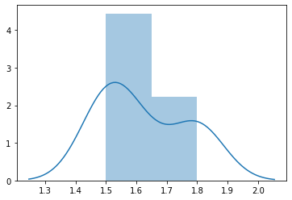

# Statistik Deskriptif

Setiap kelompok data numerik mempunyai properti tersendiri yang menjelaskan secara unik data tersebut:

Sebelum mulai, mari kita mengambil beberapa sampel data


```python
import pandas as pd
import statistics, itertools
```


```python
df = pd.read_csv('leaf.csv', nrows=9, usecols=['Aspect Ratio']) # Ambil Sampel
data = [round(x[0],1) for x in df.values] # Bulat-bulat
df = pd.DataFrame(data, columns=['sample']); # Data Frame dari Sample
dc = df['sample'] # Data set kolom sample
dc
```


    0    1.5
    1    1.5
    2    1.6
    3    1.5
    4    1.8
    5    1.5
    6    1.8
    7    1.6
    8    1.8
    Name: sample, dtype: float64


Data ini dapat kita deskripsikan menggunakan properti-properti berikut.

## Mean

Mean adalah rata-rata dari suatu dataset. Diperoleh dari sum dataset lalu dibagi dengan jumlah elemen dataset.

$$ \overline{x}=\frac{\sum_{i=1}^{N} x_{i}}{N}=\frac{x_{1}+x_{2}+\cdots+x_{N}}{N} $$


```python
print("Rata-rata", dc.values, "=", dc.mean())
```

    Rata-rata [1.5 1.5 1.6 1.5 1.8 1.5 1.8 1.6 1.8] = 1.6222222222222222
    

Mean dalam built-in python:


```python
print("Rata-rata", data, "=", statistics.mean(data))
```

    Rata-rata [1.5, 1.5, 1.6, 1.5, 1.8, 1.5, 1.8, 1.6, 1.8] = 1.6222222222222222
    

## Median

Median merupakan titik data yang paling baik apabila dataset telah diurutkan. Dalam data numerik non interval, data ke-(n-1)/2 adalah median jika n ganjil atau rata-rata dari data ke-(n/2) dan data ke-(n/2+1) jika n genap.


```python
print("Median", dc.values, "=", dc.median())
```

    Median [1.5 1.5 1.6 1.5 1.8 1.5 1.8 1.6 1.8] = 1.6
    

Median dalam built-in python:


```python
print("Median", data, "=", statistics.median(data))
```

    Median [1.5, 1.5, 1.6, 1.5, 1.8, 1.5, 1.8, 1.6, 1.8] = 1.6
    

Pembuktian dengan menyortir + eliminasi data:


```python
sorteddata = data[:]; sorteddata.sort(); 
print(sorteddata)
while(len(sorteddata)>1):
    sorteddata = sorteddata[1:-1]
    print(sorteddata)
```

    [1.5, 1.5, 1.5, 1.5, 1.6, 1.6, 1.8, 1.8, 1.8]
    [1.5, 1.5, 1.5, 1.6, 1.6, 1.8, 1.8]
    [1.5, 1.5, 1.6, 1.6, 1.8]
    [1.5, 1.6, 1.6]
    [1.6]
    

## Mode

Mode merupakan statistik untuk angka mana yang paling banyak frekuensinya dalam dataset. Mode bisa dalam bentuk diskrit atau kelompok.

Mode (diskrik) dalam built-in python:


```python
print("Median", data, "=", statistics.mode(data))
```

    Median [1.5, 1.5, 1.6, 1.5, 1.8, 1.5, 1.8, 1.6, 1.8] = 1.5
    

`scipy` mempunyai tool untuk mendeteksi mode secara lebih detail jika ada >1 value dengan frekuensi yang sama


```python
from scipy import stats
from numpy import transpose
modedata = stats.mode(dc)
pd.DataFrame(transpose([modedata.mode, modedata.count]), columns=["Mode", "Count"])
```


<div>
<style scoped>
    .dataframe tbody tr th:only-of-type {
        vertical-align: middle;
    }

    .dataframe tbody tr th {
        vertical-align: top;
    }

    .dataframe thead th {
        text-align: right;
    }
</style>
<table border="1" class="dataframe">
  <thead>
    <tr style="text-align: right;">
      <th></th>
      <th>Mode</th>
      <th>Count</th>
    </tr>
  </thead>
  <tbody>
    <tr>
      <td>0</td>
      <td>1.5</td>
      <td>4.0</td>
    </tr>
  </tbody>
</table>
</div>


Gunakan `seaborn` untuk melihat frekuensi secara grafikal:


```python
from seaborn import distplot
ax = distplot(data)
```





## Range
Range dalam suatu dataset ialah angka tertinggi dan angka terendah dalam dataset.


```python
print("Range", dc.values, ", Max:", dc.max(), "Min:", dc.min())
```

    Range [1.5 1.5 1.6 1.5 1.8 1.5 1.8 1.6 1.8] , Max: 1.8 Min: 1.5
    Range (Manual): 1.8 1.5
    

Range dalam built-in python:


```python
print("Range", data, ", Max:", max(data), "Min:", min(data))
```

    Range [1.5, 1.5, 1.6, 1.5, 1.8, 1.5, 1.8, 1.6, 1.8] , Max: 1.8 Min: 1.5
    

## Quantile

Quantil adalah jarak data yang memisahkan data sekin persen dari yang terkecil hingga tertinggi. Quantil dipisah menjadi:
+ Q1 sebagai Quantil bawah (25%) 
+ Q2 sebagai Quantil tengah (50%)
+ Q3 sebagai Quantil atas (75%)


```python
print("Quantil", dc.values, "Q1:", dc.quantile(0.25), "Q2:", dc.quantile(0.5), "Q3:", dc.quantile(0.75))
```

    Quantil [1.5 1.5 1.6 1.5 1.8 1.5 1.8 1.6 1.8] Q1: 1.5 Q2: 1.6 Q3: 1.8
    

Quantil bisa dihitung menggunakan `numpy`:


```python
from numpy import quantile
print("Quantil", data, "Q1:", quantile(data, 0.25), "Q2:", dc.quantile(0.5), "Q3:", dc.quantile(0.75))
```

    Quantil [1.5, 1.5, 1.6, 1.5, 1.8, 1.5, 1.8, 1.6, 1.8] Q1: 1.5 Q2: 1.6 Q3: 1.8
    

## Variance


```python
print("Variansi", dc.values, "=", dc.var())
```

    Variansi [1.5 1.5 1.6 1.5 1.8 1.5 1.8 1.6 1.8] = 0.01944444444444445
    


```python
print("Variansi", data, "=", statistics.variance(data))
```

    Variansi [1.5, 1.5, 1.6, 1.5, 1.8, 1.5, 1.8, 1.6, 1.8] = 0.01944444444444445
    

## Standar Deviasi


```python
print("Standar Deviasi", dc.values, "=", dc.std())
```

    Standar Deviasi [1.5 1.5 1.6 1.5 1.8 1.5 1.8 1.6 1.8] = 0.1394433377556793
    


```python
print("Variansi", data, "=", statistics.stdev(data))
```

    Variansi [1.5, 1.5, 1.6, 1.5, 1.8, 1.5, 1.8, 1.6, 1.8] = 0.1394433377556793
    

## Summary

Deskripsi Data set dalam `leaf.csv`:


```python
adf = pd.read_csv('leaf.csv')
adata = [[x, 
    adf[x].mean(), 
    adf[x].median(), 
    adf[x].min(), 
    adf[x].max(),
    adf[x].quantile(0.25),
    adf[x].quantile(0.5), 
    adf[x].quantile(0.75),
    adf[x].skew(),
    adf[x].var(),
    adf[x].std()] 
        for x in adf.columns]

pd.DataFrame(adata, columns=['Nama Kolom', 'Mean', 'Median', 'Min', 'Max', 'Q1', 'Q2', 'Q3', 'Skew', 'Var', 'Std'])
```


<div>
<style scoped>
    .dataframe tbody tr th:only-of-type {
        vertical-align: middle;
    }

    .dataframe tbody tr th {
        vertical-align: top;
    }

    .dataframe thead th {
        text-align: right;
    }
</style>
<table border="1" class="dataframe">
  <thead>
    <tr style="text-align: right;">
      <th></th>
      <th>Nama Kolom</th>
      <th>Mean</th>
      <th>Median</th>
      <th>Min</th>
      <th>Max</th>
      <th>Q1</th>
      <th>Q2</th>
      <th>Q3</th>
      <th>Skew</th>
      <th>Var</th>
      <th>Std</th>
    </tr>
  </thead>
  <tbody>
    <tr>
      <td>0</td>
      <td>Class (Species)</td>
      <td>18.544118</td>
      <td>15.000000</td>
      <td>1.000000</td>
      <td>36.000000</td>
      <td>9.000000</td>
      <td>15.000000</td>
      <td>29.000000</td>
      <td>0.006848</td>
      <td>1.243786e+02</td>
      <td>11.152514</td>
    </tr>
    <tr>
      <td>1</td>
      <td>Specimen Number</td>
      <td>6.282353</td>
      <td>6.000000</td>
      <td>1.000000</td>
      <td>16.000000</td>
      <td>3.000000</td>
      <td>6.000000</td>
      <td>9.000000</td>
      <td>0.199752</td>
      <td>1.199084e+01</td>
      <td>3.462779</td>
    </tr>
    <tr>
      <td>2</td>
      <td>Eccentricity</td>
      <td>0.719854</td>
      <td>0.763450</td>
      <td>0.117080</td>
      <td>0.998710</td>
      <td>0.550622</td>
      <td>0.763450</td>
      <td>0.895097</td>
      <td>-0.559982</td>
      <td>4.339350e-02</td>
      <td>0.208311</td>
    </tr>
    <tr>
      <td>3</td>
      <td>Aspect Ratio</td>
      <td>2.440210</td>
      <td>1.570750</td>
      <td>1.006600</td>
      <td>19.038000</td>
      <td>1.211300</td>
      <td>1.570750</td>
      <td>2.343100</td>
      <td>3.325116</td>
      <td>6.755023e+00</td>
      <td>2.599043</td>
    </tr>
    <tr>
      <td>4</td>
      <td>Elongation</td>
      <td>0.513760</td>
      <td>0.501855</td>
      <td>0.107610</td>
      <td>0.948340</td>
      <td>0.349623</td>
      <td>0.501855</td>
      <td>0.633373</td>
      <td>0.337896</td>
      <td>3.825269e-02</td>
      <td>0.195583</td>
    </tr>
    <tr>
      <td>5</td>
      <td>Solidity</td>
      <td>0.904158</td>
      <td>0.948130</td>
      <td>0.485490</td>
      <td>0.993880</td>
      <td>0.890667</td>
      <td>0.948130</td>
      <td>0.976897</td>
      <td>-2.061296</td>
      <td>1.314213e-02</td>
      <td>0.114639</td>
    </tr>
    <tr>
      <td>6</td>
      <td>Stochastic Convexity</td>
      <td>0.943793</td>
      <td>0.992980</td>
      <td>0.396490</td>
      <td>1.000000</td>
      <td>0.966230</td>
      <td>0.992980</td>
      <td>1.000000</td>
      <td>-2.633235</td>
      <td>1.323571e-02</td>
      <td>0.115047</td>
    </tr>
    <tr>
      <td>7</td>
      <td>Isoperimetric Factor</td>
      <td>0.531234</td>
      <td>0.579160</td>
      <td>0.078376</td>
      <td>0.858160</td>
      <td>0.346818</td>
      <td>0.579160</td>
      <td>0.700712</td>
      <td>-0.476601</td>
      <td>4.731998e-02</td>
      <td>0.217532</td>
    </tr>
    <tr>
      <td>8</td>
      <td>Maximal Indentation Depth</td>
      <td>0.037345</td>
      <td>0.023860</td>
      <td>0.002837</td>
      <td>0.198980</td>
      <td>0.009521</td>
      <td>0.023860</td>
      <td>0.047834</td>
      <td>1.707126</td>
      <td>1.488024e-03</td>
      <td>0.038575</td>
    </tr>
    <tr>
      <td>9</td>
      <td>Lobedness</td>
      <td>0.523845</td>
      <td>0.103615</td>
      <td>0.001464</td>
      <td>7.206200</td>
      <td>0.016500</td>
      <td>0.103615</td>
      <td>0.416433</td>
      <td>3.116157</td>
      <td>1.080850e+00</td>
      <td>1.039639</td>
    </tr>
    <tr>
      <td>10</td>
      <td>Average Intensity</td>
      <td>0.051346</td>
      <td>0.042087</td>
      <td>0.005022</td>
      <td>0.190670</td>
      <td>0.022843</td>
      <td>0.042087</td>
      <td>0.073046</td>
      <td>0.939266</td>
      <td>1.293475e-03</td>
      <td>0.035965</td>
    </tr>
    <tr>
      <td>11</td>
      <td>Average Contrast</td>
      <td>0.124535</td>
      <td>0.119375</td>
      <td>0.033415</td>
      <td>0.280810</td>
      <td>0.083362</td>
      <td>0.119375</td>
      <td>0.163795</td>
      <td>0.465029</td>
      <td>2.689420e-03</td>
      <td>0.051860</td>
    </tr>
    <tr>
      <td>12</td>
      <td>Smoothness</td>
      <td>0.017670</td>
      <td>0.014050</td>
      <td>0.001115</td>
      <td>0.073089</td>
      <td>0.006901</td>
      <td>0.014050</td>
      <td>0.026127</td>
      <td>1.213389</td>
      <td>1.892013e-04</td>
      <td>0.013755</td>
    </tr>
    <tr>
      <td>13</td>
      <td>Third moment</td>
      <td>0.005928</td>
      <td>0.004447</td>
      <td>0.000229</td>
      <td>0.029786</td>
      <td>0.002080</td>
      <td>0.004447</td>
      <td>0.008307</td>
      <td>1.780473</td>
      <td>2.802772e-05</td>
      <td>0.005294</td>
    </tr>
    <tr>
      <td>14</td>
      <td>Uniformity</td>
      <td>0.000387</td>
      <td>0.000239</td>
      <td>0.000007</td>
      <td>0.002936</td>
      <td>0.000102</td>
      <td>0.000239</td>
      <td>0.000516</td>
      <td>2.125278</td>
      <td>1.861405e-07</td>
      <td>0.000431</td>
    </tr>
    <tr>
      <td>15</td>
      <td>Entropy</td>
      <td>1.162630</td>
      <td>1.077450</td>
      <td>0.169400</td>
      <td>2.708500</td>
      <td>0.718900</td>
      <td>1.077450</td>
      <td>1.554575</td>
      <td>0.490110</td>
      <td>3.420539e-01</td>
      <td>0.584854</td>
    </tr>
  </tbody>
</table>
</div>


```python

```
