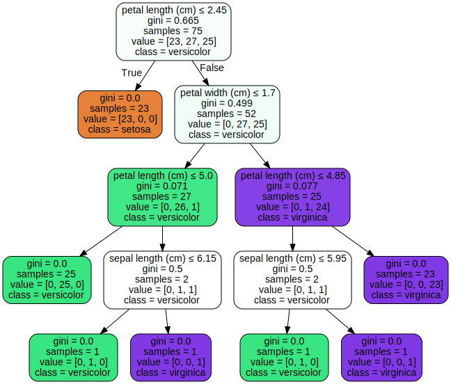

# Decision Tree


```python
#Contoh eksekusi

from sklearn import datasets, model_selection
from pandas import *
from sklearn.metrics import classification_report, confusion_matrix, accuracy_score
from sklearn.tree import DecisionTreeClassifier, plot_tree
from sklearn.tree import export_graphviz
import graphviz

from IPython.display import HTML, display; from tabulate import tabulate
def table(df): display(HTML(tabulate(df, tablefmt='html', headers='keys', showindex=False)))

```


```python

iris = datasets.load_iris()
data = [list(s)+[iris.target_names[iris.target[i]]] for i,s in enumerate(iris.data)]
dataset = DataFrame(data, columns=iris.feature_names+['class'])

array = dataset.values
X = array[:,0:4]
Y = array[:,4]

X_train, X_validation, Y_train, Y_validation = \
        model_selection.train_test_split(X, Y, \
        train_size=0.5, random_state=2)
classifier = DecisionTreeClassifier()
fitting = classifier.fit(X_train, Y_train)
p = classifier.predict(X_validation)


pdd = DataFrame([list(X_validation[i])+[Y_validation[i],p[i]] for i in range(X_validation.shape[0])])
table(pdd)
print("Akurasi: ", accuracy_score(Y_validation, p))
```


<table>
<thead>
<tr><th style="text-align: right;">  0</th><th style="text-align: right;">  1</th><th style="text-align: right;">  2</th><th style="text-align: right;">  3</th><th>4         </th><th>5         </th></tr>
</thead>
<tbody>
<tr><td style="text-align: right;">4.6</td><td style="text-align: right;">3.4</td><td style="text-align: right;">1.4</td><td style="text-align: right;">0.3</td><td>setosa    </td><td>setosa    </td></tr>
<tr><td style="text-align: right;">4.6</td><td style="text-align: right;">3.1</td><td style="text-align: right;">1.5</td><td style="text-align: right;">0.2</td><td>setosa    </td><td>setosa    </td></tr>
<tr><td style="text-align: right;">5.7</td><td style="text-align: right;">2.5</td><td style="text-align: right;">5  </td><td style="text-align: right;">2  </td><td>virginica </td><td>virginica </td></tr>
<tr><td style="text-align: right;">4.8</td><td style="text-align: right;">3  </td><td style="text-align: right;">1.4</td><td style="text-align: right;">0.1</td><td>setosa    </td><td>setosa    </td></tr>
<tr><td style="text-align: right;">4.8</td><td style="text-align: right;">3.4</td><td style="text-align: right;">1.9</td><td style="text-align: right;">0.2</td><td>setosa    </td><td>setosa    </td></tr>
<tr><td style="text-align: right;">7.2</td><td style="text-align: right;">3  </td><td style="text-align: right;">5.8</td><td style="text-align: right;">1.6</td><td>virginica </td><td>virginica </td></tr>
<tr><td style="text-align: right;">5  </td><td style="text-align: right;">3  </td><td style="text-align: right;">1.6</td><td style="text-align: right;">0.2</td><td>setosa    </td><td>setosa    </td></tr>
<tr><td style="text-align: right;">6.7</td><td style="text-align: right;">2.5</td><td style="text-align: right;">5.8</td><td style="text-align: right;">1.8</td><td>virginica </td><td>virginica </td></tr>
<tr><td style="text-align: right;">6.4</td><td style="text-align: right;">2.8</td><td style="text-align: right;">5.6</td><td style="text-align: right;">2.1</td><td>virginica </td><td>virginica </td></tr>
<tr><td style="text-align: right;">4.8</td><td style="text-align: right;">3  </td><td style="text-align: right;">1.4</td><td style="text-align: right;">0.3</td><td>setosa    </td><td>setosa    </td></tr>
<tr><td style="text-align: right;">5.3</td><td style="text-align: right;">3.7</td><td style="text-align: right;">1.5</td><td style="text-align: right;">0.2</td><td>setosa    </td><td>setosa    </td></tr>
<tr><td style="text-align: right;">4.4</td><td style="text-align: right;">3.2</td><td style="text-align: right;">1.3</td><td style="text-align: right;">0.2</td><td>setosa    </td><td>setosa    </td></tr>
<tr><td style="text-align: right;">5  </td><td style="text-align: right;">3.2</td><td style="text-align: right;">1.2</td><td style="text-align: right;">0.2</td><td>setosa    </td><td>setosa    </td></tr>
<tr><td style="text-align: right;">5.4</td><td style="text-align: right;">3.9</td><td style="text-align: right;">1.7</td><td style="text-align: right;">0.4</td><td>setosa    </td><td>setosa    </td></tr>
<tr><td style="text-align: right;">6  </td><td style="text-align: right;">3.4</td><td style="text-align: right;">4.5</td><td style="text-align: right;">1.6</td><td>versicolor</td><td>versicolor</td></tr>
<tr><td style="text-align: right;">6.5</td><td style="text-align: right;">2.8</td><td style="text-align: right;">4.6</td><td style="text-align: right;">1.5</td><td>versicolor</td><td>versicolor</td></tr>
<tr><td style="text-align: right;">4.5</td><td style="text-align: right;">2.3</td><td style="text-align: right;">1.3</td><td style="text-align: right;">0.3</td><td>setosa    </td><td>setosa    </td></tr>
<tr><td style="text-align: right;">5.7</td><td style="text-align: right;">2.9</td><td style="text-align: right;">4.2</td><td style="text-align: right;">1.3</td><td>versicolor</td><td>versicolor</td></tr>
<tr><td style="text-align: right;">6.7</td><td style="text-align: right;">3.3</td><td style="text-align: right;">5.7</td><td style="text-align: right;">2.5</td><td>virginica </td><td>virginica </td></tr>
<tr><td style="text-align: right;">5.5</td><td style="text-align: right;">2.5</td><td style="text-align: right;">4  </td><td style="text-align: right;">1.3</td><td>versicolor</td><td>versicolor</td></tr>
<tr><td style="text-align: right;">6.7</td><td style="text-align: right;">3  </td><td style="text-align: right;">5  </td><td style="text-align: right;">1.7</td><td>versicolor</td><td>virginica </td></tr>
<tr><td style="text-align: right;">6.4</td><td style="text-align: right;">2.9</td><td style="text-align: right;">4.3</td><td style="text-align: right;">1.3</td><td>versicolor</td><td>versicolor</td></tr>
<tr><td style="text-align: right;">6.4</td><td style="text-align: right;">3.2</td><td style="text-align: right;">5.3</td><td style="text-align: right;">2.3</td><td>virginica </td><td>virginica </td></tr>
<tr><td style="text-align: right;">5.6</td><td style="text-align: right;">2.7</td><td style="text-align: right;">4.2</td><td style="text-align: right;">1.3</td><td>versicolor</td><td>versicolor</td></tr>
<tr><td style="text-align: right;">6.3</td><td style="text-align: right;">2.3</td><td style="text-align: right;">4.4</td><td style="text-align: right;">1.3</td><td>versicolor</td><td>versicolor</td></tr>
<tr><td style="text-align: right;">4.7</td><td style="text-align: right;">3.2</td><td style="text-align: right;">1.6</td><td style="text-align: right;">0.2</td><td>setosa    </td><td>setosa    </td></tr>
<tr><td style="text-align: right;">4.7</td><td style="text-align: right;">3.2</td><td style="text-align: right;">1.3</td><td style="text-align: right;">0.2</td><td>setosa    </td><td>setosa    </td></tr>
<tr><td style="text-align: right;">6.1</td><td style="text-align: right;">3  </td><td style="text-align: right;">4.9</td><td style="text-align: right;">1.8</td><td>virginica </td><td>virginica </td></tr>
<tr><td style="text-align: right;">5.1</td><td style="text-align: right;">3.8</td><td style="text-align: right;">1.9</td><td style="text-align: right;">0.4</td><td>setosa    </td><td>setosa    </td></tr>
<tr><td style="text-align: right;">7.2</td><td style="text-align: right;">3.2</td><td style="text-align: right;">6  </td><td style="text-align: right;">1.8</td><td>virginica </td><td>virginica </td></tr>
<tr><td style="text-align: right;">6.2</td><td style="text-align: right;">2.8</td><td style="text-align: right;">4.8</td><td style="text-align: right;">1.8</td><td>virginica </td><td>virginica </td></tr>
<tr><td style="text-align: right;">5.1</td><td style="text-align: right;">3.3</td><td style="text-align: right;">1.7</td><td style="text-align: right;">0.5</td><td>setosa    </td><td>setosa    </td></tr>
<tr><td style="text-align: right;">5.6</td><td style="text-align: right;">2.9</td><td style="text-align: right;">3.6</td><td style="text-align: right;">1.3</td><td>versicolor</td><td>versicolor</td></tr>
<tr><td style="text-align: right;">7.7</td><td style="text-align: right;">3.8</td><td style="text-align: right;">6.7</td><td style="text-align: right;">2.2</td><td>virginica </td><td>virginica </td></tr>
<tr><td style="text-align: right;">5.4</td><td style="text-align: right;">3  </td><td style="text-align: right;">4.5</td><td style="text-align: right;">1.5</td><td>versicolor</td><td>versicolor</td></tr>
<tr><td style="text-align: right;">5.8</td><td style="text-align: right;">4  </td><td style="text-align: right;">1.2</td><td style="text-align: right;">0.2</td><td>setosa    </td><td>setosa    </td></tr>
<tr><td style="text-align: right;">6.4</td><td style="text-align: right;">2.8</td><td style="text-align: right;">5.6</td><td style="text-align: right;">2.2</td><td>virginica </td><td>virginica </td></tr>
<tr><td style="text-align: right;">6.1</td><td style="text-align: right;">3  </td><td style="text-align: right;">4.6</td><td style="text-align: right;">1.4</td><td>versicolor</td><td>versicolor</td></tr>
<tr><td style="text-align: right;">5.5</td><td style="text-align: right;">2.3</td><td style="text-align: right;">4  </td><td style="text-align: right;">1.3</td><td>versicolor</td><td>versicolor</td></tr>
<tr><td style="text-align: right;">6.9</td><td style="text-align: right;">3.1</td><td style="text-align: right;">5.1</td><td style="text-align: right;">2.3</td><td>virginica </td><td>virginica </td></tr>
<tr><td style="text-align: right;">6  </td><td style="text-align: right;">2.9</td><td style="text-align: right;">4.5</td><td style="text-align: right;">1.5</td><td>versicolor</td><td>versicolor</td></tr>
<tr><td style="text-align: right;">6.2</td><td style="text-align: right;">2.9</td><td style="text-align: right;">4.3</td><td style="text-align: right;">1.3</td><td>versicolor</td><td>versicolor</td></tr>
<tr><td style="text-align: right;">6.8</td><td style="text-align: right;">3.2</td><td style="text-align: right;">5.9</td><td style="text-align: right;">2.3</td><td>virginica </td><td>virginica </td></tr>
<tr><td style="text-align: right;">5  </td><td style="text-align: right;">2.3</td><td style="text-align: right;">3.3</td><td style="text-align: right;">1  </td><td>versicolor</td><td>versicolor</td></tr>
<tr><td style="text-align: right;">4.8</td><td style="text-align: right;">3.4</td><td style="text-align: right;">1.6</td><td style="text-align: right;">0.2</td><td>setosa    </td><td>setosa    </td></tr>
<tr><td style="text-align: right;">6.1</td><td style="text-align: right;">2.6</td><td style="text-align: right;">5.6</td><td style="text-align: right;">1.4</td><td>virginica </td><td>versicolor</td></tr>
<tr><td style="text-align: right;">5.2</td><td style="text-align: right;">3.4</td><td style="text-align: right;">1.4</td><td style="text-align: right;">0.2</td><td>setosa    </td><td>setosa    </td></tr>
<tr><td style="text-align: right;">6.7</td><td style="text-align: right;">3.1</td><td style="text-align: right;">4.4</td><td style="text-align: right;">1.4</td><td>versicolor</td><td>versicolor</td></tr>
<tr><td style="text-align: right;">5.1</td><td style="text-align: right;">3.5</td><td style="text-align: right;">1.4</td><td style="text-align: right;">0.2</td><td>setosa    </td><td>setosa    </td></tr>
<tr><td style="text-align: right;">5.2</td><td style="text-align: right;">3.5</td><td style="text-align: right;">1.5</td><td style="text-align: right;">0.2</td><td>setosa    </td><td>setosa    </td></tr>
<tr><td style="text-align: right;">5.5</td><td style="text-align: right;">3.5</td><td style="text-align: right;">1.3</td><td style="text-align: right;">0.2</td><td>setosa    </td><td>setosa    </td></tr>
<tr><td style="text-align: right;">4.9</td><td style="text-align: right;">2.5</td><td style="text-align: right;">4.5</td><td style="text-align: right;">1.7</td><td>virginica </td><td>versicolor</td></tr>
<tr><td style="text-align: right;">6.2</td><td style="text-align: right;">3.4</td><td style="text-align: right;">5.4</td><td style="text-align: right;">2.3</td><td>virginica </td><td>virginica </td></tr>
<tr><td style="text-align: right;">7.9</td><td style="text-align: right;">3.8</td><td style="text-align: right;">6.4</td><td style="text-align: right;">2  </td><td>virginica </td><td>virginica </td></tr>
<tr><td style="text-align: right;">5.4</td><td style="text-align: right;">3.4</td><td style="text-align: right;">1.7</td><td style="text-align: right;">0.2</td><td>setosa    </td><td>setosa    </td></tr>
<tr><td style="text-align: right;">6.7</td><td style="text-align: right;">3.1</td><td style="text-align: right;">5.6</td><td style="text-align: right;">2.4</td><td>virginica </td><td>virginica </td></tr>
<tr><td style="text-align: right;">6.3</td><td style="text-align: right;">3.4</td><td style="text-align: right;">5.6</td><td style="text-align: right;">2.4</td><td>virginica </td><td>virginica </td></tr>
<tr><td style="text-align: right;">7.6</td><td style="text-align: right;">3  </td><td style="text-align: right;">6.6</td><td style="text-align: right;">2.1</td><td>virginica </td><td>virginica </td></tr>
<tr><td style="text-align: right;">6  </td><td style="text-align: right;">2.2</td><td style="text-align: right;">5  </td><td style="text-align: right;">1.5</td><td>virginica </td><td>versicolor</td></tr>
<tr><td style="text-align: right;">4.3</td><td style="text-align: right;">3  </td><td style="text-align: right;">1.1</td><td style="text-align: right;">0.1</td><td>setosa    </td><td>setosa    </td></tr>
<tr><td style="text-align: right;">4.8</td><td style="text-align: right;">3.1</td><td style="text-align: right;">1.6</td><td style="text-align: right;">0.2</td><td>setosa    </td><td>setosa    </td></tr>
<tr><td style="text-align: right;">5.8</td><td style="text-align: right;">2.7</td><td style="text-align: right;">5.1</td><td style="text-align: right;">1.9</td><td>virginica </td><td>virginica </td></tr>
<tr><td style="text-align: right;">5.7</td><td style="text-align: right;">2.8</td><td style="text-align: right;">4.1</td><td style="text-align: right;">1.3</td><td>versicolor</td><td>versicolor</td></tr>
<tr><td style="text-align: right;">5.2</td><td style="text-align: right;">2.7</td><td style="text-align: right;">3.9</td><td style="text-align: right;">1.4</td><td>versicolor</td><td>versicolor</td></tr>
<tr><td style="text-align: right;">7.7</td><td style="text-align: right;">3  </td><td style="text-align: right;">6.1</td><td style="text-align: right;">2.3</td><td>virginica </td><td>virginica </td></tr>
<tr><td style="text-align: right;">6.3</td><td style="text-align: right;">2.7</td><td style="text-align: right;">4.9</td><td style="text-align: right;">1.8</td><td>virginica </td><td>virginica </td></tr>
<tr><td style="text-align: right;">6.1</td><td style="text-align: right;">2.8</td><td style="text-align: right;">4  </td><td style="text-align: right;">1.3</td><td>versicolor</td><td>versicolor</td></tr>
<tr><td style="text-align: right;">5.1</td><td style="text-align: right;">3.7</td><td style="text-align: right;">1.5</td><td style="text-align: right;">0.4</td><td>setosa    </td><td>setosa    </td></tr>
<tr><td style="text-align: right;">5.7</td><td style="text-align: right;">2.8</td><td style="text-align: right;">4.5</td><td style="text-align: right;">1.3</td><td>versicolor</td><td>versicolor</td></tr>
<tr><td style="text-align: right;">5.4</td><td style="text-align: right;">3.9</td><td style="text-align: right;">1.3</td><td style="text-align: right;">0.4</td><td>setosa    </td><td>setosa    </td></tr>
<tr><td style="text-align: right;">5.8</td><td style="text-align: right;">2.8</td><td style="text-align: right;">5.1</td><td style="text-align: right;">2.4</td><td>virginica </td><td>virginica </td></tr>
<tr><td style="text-align: right;">5.8</td><td style="text-align: right;">2.6</td><td style="text-align: right;">4  </td><td style="text-align: right;">1.2</td><td>versicolor</td><td>versicolor</td></tr>
<tr><td style="text-align: right;">5.1</td><td style="text-align: right;">2.5</td><td style="text-align: right;">3  </td><td style="text-align: right;">1.1</td><td>versicolor</td><td>versicolor</td></tr>
<tr><td style="text-align: right;">5.7</td><td style="text-align: right;">3.8</td><td style="text-align: right;">1.7</td><td style="text-align: right;">0.3</td><td>setosa    </td><td>setosa    </td></tr>
<tr><td style="text-align: right;">5.5</td><td style="text-align: right;">2.4</td><td style="text-align: right;">3.7</td><td style="text-align: right;">1  </td><td>versicolor</td><td>versicolor</td></tr>
</tbody>
</table>


    Akurasi:  0.9466666666666667
    


```python
dot_data = export_graphviz(classifier, out_file=None, 
                      feature_names=iris.feature_names,  
                     class_names=iris.target_names,  
                   filled=True, rounded=True,  
                   special_characters=True)  
graphviz.Source(dot_data)
```





